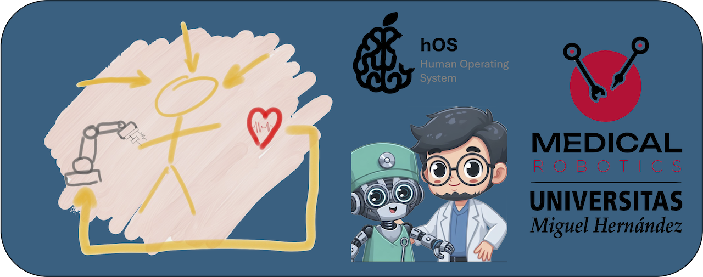

## Hola, mi nombre el Jose Maria Sabater
### ✨ Healthnology lover ✨
<!--
**jmsabater/jmsabater** is a ✨ _special_ ✨ repository because its `README.md` (this file) appears on your GitHub profile.

Here are some ideas to get you started:

- 🔭 I’m currently working on ...
- 🌱 I’m currently learning ...
- 👯 I’m looking to collaborate on ...
- 🤔 I’m looking for help with ...
- 💬 Ask me about ...
- 📫 How to reach me: ...
- 😄 Pronouns: ...
- ⚡ Fun fact: ...
-->

Soy Catedrático de Universidad en la [U. Miguel Hernandez de Elche](https://www.umh.es) y un apasionado de la mejora de la calidad de vida gracias a la tecnologia.
Coordino la [Unidad de Robotica Médica](https://www.medicalrobotics.umh.es) del Instituto de Bioingeniería 
>[!TIP]
>“El verdadero progreso es el que pone la tecnología al alcance de todos”. Henry Ford (1863-1947)

## Encuéntrame en:

# Algunos proyectos de la comunidad
